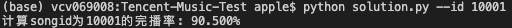
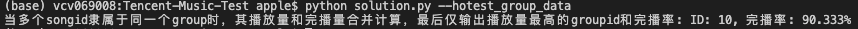

# Tencent-Music-Test

## a 我将如何定义完播率？
1. 朴素的：所有歌里，只要点开听了，算作播放量+1，如果听完了，完播量+1.最后```完播量/播放量```为完播率。
2. 或者：某人开始播放这首歌，则播放量+1，这首歌听了m%便切换（m是听的时长/总时长，考虑到掐头去尾，跳放，当发生回退时，会出现m>100的情况），则```m%```为完播率。

## b 计算完播率

给定已有数据已经写入```data.csv```文件

1\. 计算songid的完播率:
```
python solution.py --id "id"
```
demo:



2\. 当多个songid隶属于同一个group时，其播放量和完播量合并计算，最后仅输出播放量最高的groupid和完播率

```
python solution.py --hotest_group_data
```
demo:




